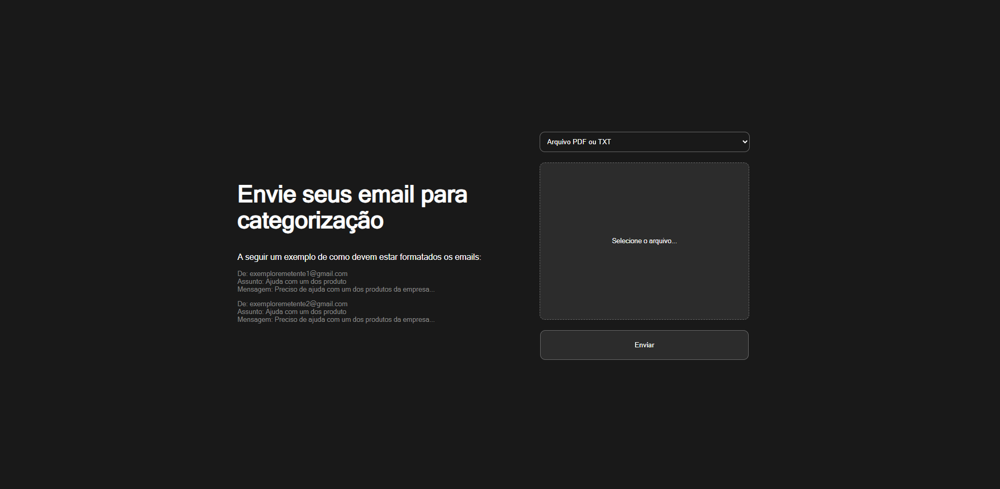
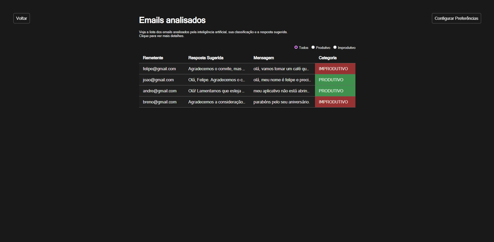

# AutoU-Case
Esta aplicação consiste em uma automação para emails, a qual, entre outras coisas, gera uma classificação e uma sugestão de resposta para um conjunto de emails, que podem ser enviados por meio de arquivos `.txt`, `.pdf` ou por texto manuscrito. Tudo isso feito por IA. Você pode acessar a aplicação online pelo link https://email-classifier-frontend-three.vercel.app/





## 🚀 Funcionalidades

* **Entrada Flexível de E-mails:**
    * Upload de arquivos de emails nos formatos `.txt` ou `.pdf`.
    * Inclusão direta de texto de emails através de área de texto.

* **Classificação de E-mails com IA:**
    * Utiliza o modelo de IA do Google, o Gemini, para analisar os emails enviados.
    * Capacidade de classificar e-mails em **português** e **inglês**.
* **Sugestão de Respostas Automáticas:**
    * Gera uma resposta personalizada para cada caso, baseado na categoria e no contexto do email.
* **Interface Intuitiva:**
    * Interface de usuário moderna, eficiente e intuitíva, desenvolvida em React e TypeScript.
    * Exibição clara dos resultados da classificação e da resposta sugerida.

## 🛠️ Tecnologias Utilizadas

**Backend:**
* **Python 3.12:** Linguagem de programação principal.
* **Flask:** Microframework web para construção da API REST.
* **Flask-Cors:** Gerenciamento de políticas CORS.
* **Google-Generativeai:** Biblioteca para uso de modelos de IA do Google.
* **PyPDF2:** Extração de texto de arquivos PDF.
* **Gunicorn:** Servidor WSGI para produção do Flask.
* **Docker:** Containerização do backend.

**Frontend:**
* **React:** Biblioteca JavaScript para construção da interface de usuário.
* **TypeScript:** Superset do JavaScript que adiciona tipagem estática.

---

## ⚙️ Como rodar o projeto localmente

Siga os passos abaixo para configurar seu ambiente de desenvolvimento.

### Pré-requisitos

* **Node.js e npm/yarn:** Para o frontend React.
* **Python 3.12:** Para o backend Flask.
* **pip:** Gerenciador de pacotes Python.
* **Docker Engine:** Para executar o backend containerizado.
* **Git:** Para clonar o repositório.

### Clonar o Repositório

```bash
git clone git@github.com:Felihum/AutoU-Case.git
```

### Iniciar a Aplicação Completa (Frontend e Backend)

1.  Abra seu terminal e navegue para a **raiz do seu repositório** (onde está o `docker-compose.yml`, `backend/` e `frontend/`):

2.  Na primeira vez que você rodar (ou após grandes alterações em dependências/código), construa as imagens Docker sem usar o cache para garantir que tudo esteja atualizado:

```bash
docker compose build --no-cache backend
```

**Observação:** A construção da imagem pode demorar alguns minutos (devido à instalação de bibliotecas da aplicação). Em execuções futuras, você pode omitir `--no-cache` para usar o cache e acelerar o processo.

3.  Após a construção (ou em execuções subsequentes), inicie os serviços Docker Compose:

```bash
docker compose up -d
```
**`-d`:** Inicia os contêineres em segundo plano (detached mode), liberando seu terminal.

4.  Entre na pasta do frontend:

```bash
cd frontend
```

5.  Instale as dependências:

```bash
npm i
```

6.  Inicie o frontend

```bash
npm start
```